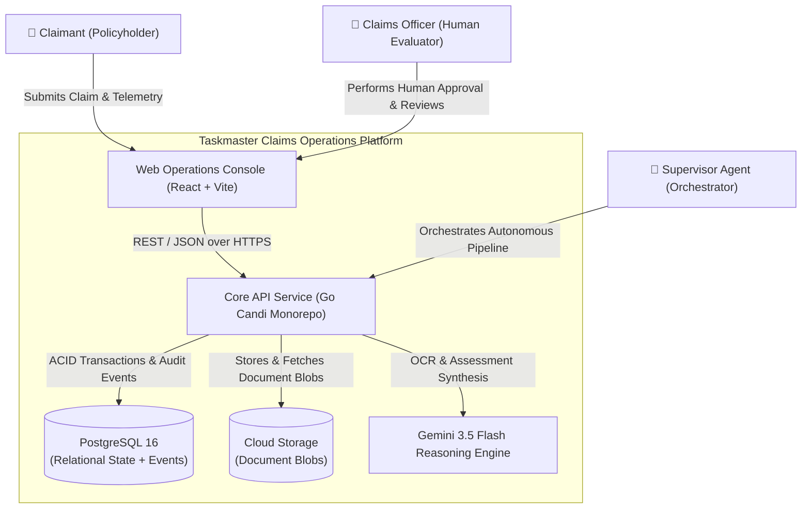
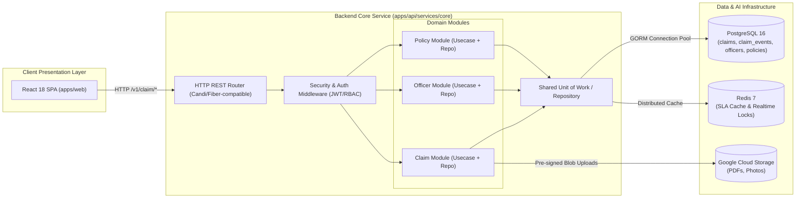
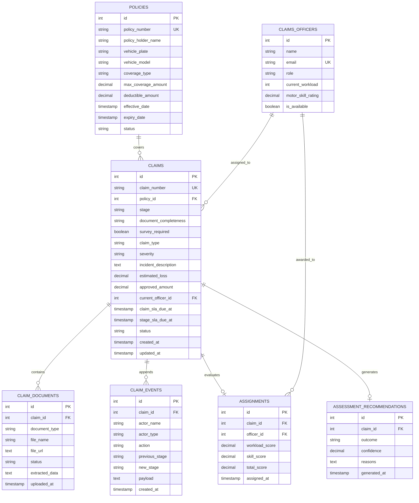
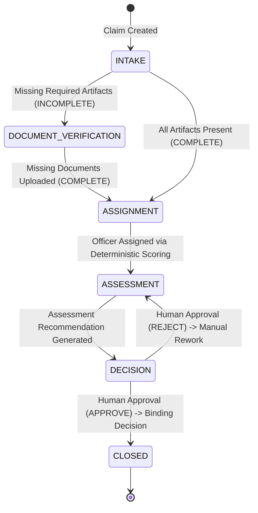
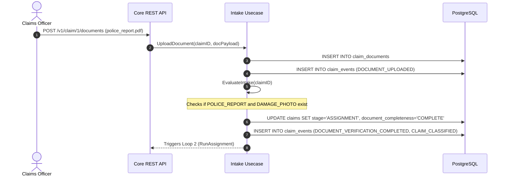
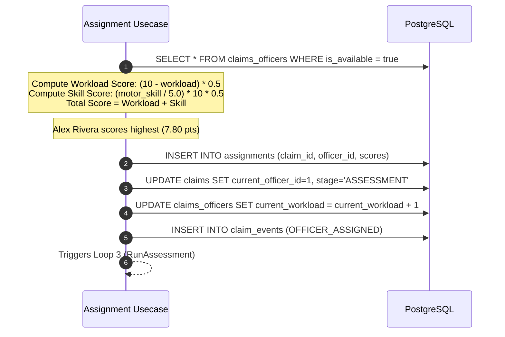
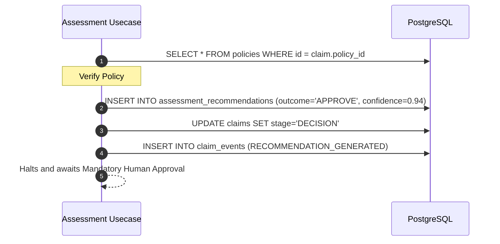
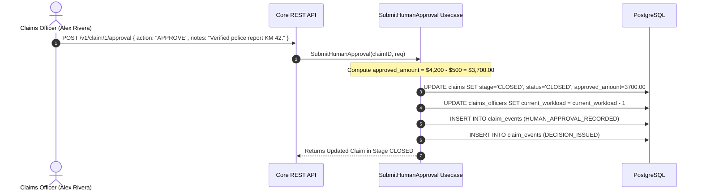

# Backend Architecture & Technical Specification

> **Visual architecture:** [`architecture.html`](architecture.html) renders the system
> topology, the four loops, and the request lifecycle as diagrams. Open it directly in a
> browser — it needs no server.

## 1. System Overview & Architecture (C4 Model)

Taskmaster Claims Operations backend (`apps/api/services/core`) is an enterprise-grade Go service built on top of the **Candi Clean Architecture Framework**. It provides a unified orchestration layer for general-insurance claims lifecycle management, deterministic SLA tracking, autonomous multi-agent choreographies, and mandatory Human-in-the-Loop decision governance.

### 1.1 System Context Diagram (C4 Level 1)



---

### 1.2 Container Architecture (C4 Level 2)



---

### 1.3 Component & Clean Architecture Breakdown (C4 Level 3)

The backend strictly follows Hexagonal / Clean Architecture principles:

```
apps/api/services/core/
├── cmd/
│   └── migration/               # Goose SQL database migrations
├── configs/                     # Environment and database connection configurations
├── internal/modules/
│   ├── claim/
│   │   ├── delivery/resthandler/# HTTP handlers, route registration, and DTO parsing
│   │   ├── domain/              # Request, Response, and Filter DTOs
│   │   ├── repository/          # GORM SQL data access layer and preload logic
│   │   └── usecase/             # Pure business logic and autonomous agent triggers
│   ├── officer/                 # Claims Officer management and workload tracking
│   └── policy/                  # In-force policy contract verification
└── pkg/
    └── shared/
        ├── domain/              # Core domain entities (Claim, Policy, Officer, Event, Assignment)
        ├── repository/          # Centralized repository interface and transaction runner (WithTransaction)
        └── usecase/             # Shared usecase registry and common interfaces
```

---

## 2. Database Schema & Entity-Relationship Diagram (ERD)



---

## 3. Claim State Machine & Lifecycle Transitions

The Claim progression follows an immutable state machine strictly mapped to the canonical domain language ([`CONTEXT.md`](file:///Users/dimas/Documents/Project/personal/klemarklemer/CONTEXT.md)):



### Valid Transition Matrix

| Current Stage | Event / Action Trigger | Target Stage | Precondition Check |
|---|---|---|---|
| `INTAKE` | `CLAIM_CREATED` | `DOCUMENT_VERIFICATION` | Initial intake checks document completeness. |
| `DOCUMENT_VERIFICATION` | `DOCUMENT_UPLOADED` | `ASSIGNMENT` | `POLICE_REPORT` and `DAMAGE_PHOTO` both verified. |
| `ASSIGNMENT` | `OFFICER_ASSIGNED` | `ASSESSMENT` | Deterministic score calculated; officer bound to claim. |
| `ASSESSMENT` | `RECOMMENDATION_GENERATED` | `DECISION` | Coverage limits checked vs estimated loss; recommendation synthesized. |
| `DECISION` | `HUMAN_APPROVAL_RECORDED` | `CLOSED` | Human officer accepts recommendation; binding Decision recorded; settlement calculated. |
| `DECISION` | `HUMAN_APPROVAL_REJECTED` | `ASSESSMENT` | Human officer rejects recommendation for reassessment. |

---

## 4. End-to-End Execution Flows (The 4 Autonomous Claim Loops)

### Loop 1: Ingestion & Autonomous Intake Verification


### Loop 2: Deterministic Officer Assignment


### Loop 3: Assessment Recommendation Reasoning


### Loop 4: Human Approval Checkpoint & Binding Decision


---

## 5. Deterministic SLA Clock Formulation

SLA deadlines are calculated deterministically to maintain strict operational compliance:

$$\text{Claim SLA Deadline} = \text{CreatedAt} + 4\text{ hours}$$
$$\text{Stage SLA Deadline} = \text{StageEntryTime} + \Delta T_{\text{stage}}$$

Where $\Delta T_{\text{stage}}$ is allocated as:
- **Intake / Document Verification**: $30\text{ minutes}$
- **Assignment**: $20\text{ minutes}$
- **Assessment**: $15\text{ minutes}$
- **Decision (Human Approval)**: $10\text{ minutes}$

---

## 6. API Error Codes & Standard Response Structure

All API responses follow the standardized Candi JSON envelope:

```json
{
  "code": 200,
  "message": "Success",
  "data": { ... },
  "meta": {
    "page": 1,
    "limit": 10,
    "totalRecords": 1,
    "totalPages": 1
  }
}
```

| HTTP Status Code | Description | Example Condition |
|---|---|---|
| `200 OK` | Request succeeded with payload data. | `GET /v1/claim/1`, `POST /v1/claim/1/approval` |
| `201 Created` | Resource created successfully. | `POST /v1/claim` |
| `400 Bad Request` | Malformed JSON or invalid schema parameters. | Missing `action` in Human approval payload. |
| `404 Not Found` | Claim ID, Officer ID, or Policy not found. | `GET /v1/claim/9999` |
| `500 Internal Server Error` | Database transaction failure or unhandled exception. | DB connection timeout during commit. |
