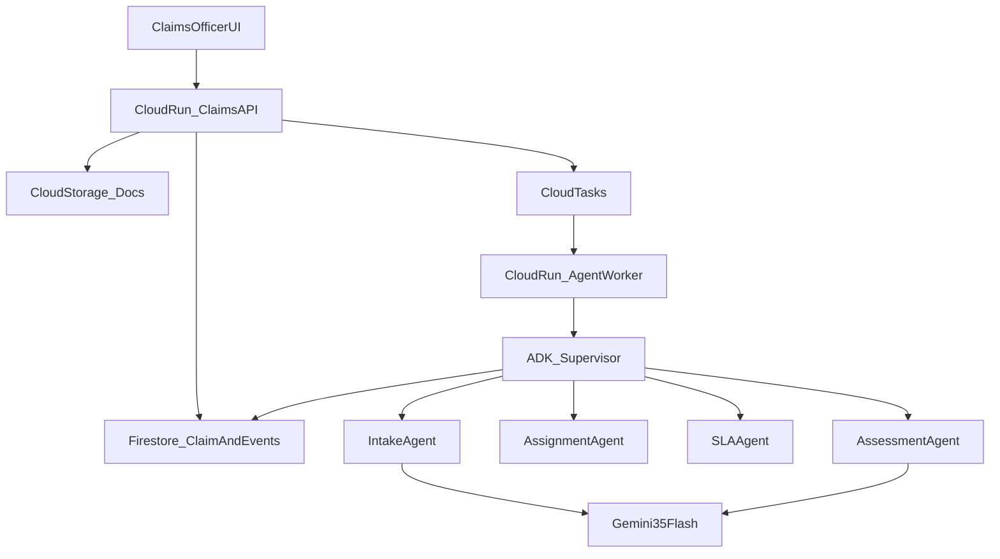

# RFC 0001: Agentic claims operations on Google Cloud (hackathon)

**Status:** accepted for the Taskmaster tracer bullet  
**Track:** All Things Agentic Hackathon — The Taskmaster  
**PRD:** [taskmaster-claims-ops.md](../prd/taskmaster-claims-ops.md)  
**Vision (not this cut):** [agentic_claims_operations_sla_plan.md](../../agentic_claims_operations_sla_plan.md)  
**ADRs:** [0001](../adr/0001-adk-multi-agent-not-one-god-agent.md), [0002](../adr/0002-firestore-operational-state.md), [0003](../adr/0003-deterministic-rules-plus-gemini.md)

## Problem

The vision platform is a five-phase enterprise claims command centre. The hackathon needs a **deployed, event-driven coordinator** that completes one motor Claim with proof on Google Cloud, using Gemini 3.5 Flash and Google ADK, without Cloud Workflows or a full Policy engine.

## Proposal

One Cloud Run service exposes the claims API and the agent worker. Cloud Tasks enqueue document jobs and SLA ticks. Firestore holds Claim operational state and immutable Claim events. Cloud Storage holds artifacts. Google ADK runs a Supervisor that reads Claim state and invokes Intake, Assignment, SLA, and Assessment specialists. Gemini 3.5 Flash is used for extraction and assessment reasoning only. SLA clocks and Assignment scores are deterministic code. Human approval is required before a Decision.

## Architecture (submission diagram)

Export this mermaid (or redraw identically) for Devpost.

**Draw this for judges:** UI → Cloud Run → Firestore / GCS / Cloud Tasks → same Cloud Run worker → ADK Supervisor → four specialists → Gemini 3.5 Flash on Intake and Assessment only. No Cloud Workflows box.

Same topology as the vision file’s Cloud Run / Firestore / GCS / Tasks / ADK / Gemini / OTel story, minus Cloud Workflows.

## ADK topology

- **Supervisor:** only agent that decides the next step from Claim state. Specialists do not call each other.
- **Intake Agent:** documents, Document completeness, classification. Uses Gemini.
- **Assignment Agent:** scores seeded claims officers; writes Assignment. No Gemini required.
- **SLA Agent:** evaluates SLA clocks; writes at-risk Claim events and in-app notices. No Gemini required.
- **Assessment Agent:** Assessment recommendation from Policy + documents. Uses Gemini. Does not write a Decision.

## Process (hackathon)

1. Receive / seed Claim  
2. Validate documents (Intake)  
3. Classify (Intake); demo Claim has no Survey  
4. Assign (Assignment Agent)  
5. SLA tick (Cloud Tasks → SLA Agent)  
6. Assessment recommendation (Assessment Agent)  
7. Human approval → Decision  
8. PDF (ReportLab) → GCS  
9. Close Claim  

Waits are Firestore Stage + Cloud Tasks, not a workflow engine wait.

## State model

Firestore collections (logical): `claims`, `employees`, `policies`, `claim_events`, `assignments`, `sla_rules`, `notifications`, `ai_assessments`.

A Claim document holds identifiers, current Stage, Assignment, claim-level and stage-level SLA clock timestamps, classification, and flags such as `survey_required` (false on the seeded Claim).

Claim events are append-only: timestamp, actor (agent name or claims officer id), action, previous Stage, new Stage, correlation ids.

GCS: `claims/{claim_id}/submitted/`, `generated/`. Firestore stores object references, not file bytes.

## Task and event contracts

Cloud Tasks payloads are small: `claim_id`, `job_kind` (`document_intake` | `sla_tick` | `assessment` | `report_pdf`), optional `idempotency_key`.

API (conceptual): create/get Claim, list Claim events, upload document, approve/reject Assessment recommendation, seed demo. Uploads write GCS then enqueue `document_intake`. Approve writes Decision, enqueue `report_pdf`, close Claim.

Idempotency: same `idempotency_key` does not double-assign or double-notify.

## Human in the loop

Human approval is mandatory for the demo Claim even if the Assessment recommendation is APPROVE. Assessment Agent never closes a Claim.

## Observability

OpenTelemetry traces: API → worker → Supervisor → specialist → Gemini. Structured logs include `claim_id`, `trace_id`, `agent_name`, `action`, `model_name`, `confidence` where applicable. Cloud Logging for debug and the demo “GCP proof” shot.

## Cost

Cloud Run min instances 0, max instances capped. Gemini 3.5 Flash only. Tear down after the video. Synthetic documents only. Budget alerts on the billing account.

## Threat / PII

Demo data is synthetic. No production Policy holders. Public Cloud Run must not be an open anonymous write API in a way that burns credits (API key or IAP for the demo URL). Prompts must not treat uploaded PDFs as executable instructions beyond extraction (basic instruction hierarchy in agent system prompts). Not Model Armor; Fleet track is out of scope.

## Alternatives rejected

| Alternative | Why not this weekend |
|---|---|
| Cloud Workflows for the Claim path | Extra product and wait semantics; Supervisor + Tasks is enough for one Claim. |
| One “god” ADK agent | Harder to test, weaker architecture story; see ADR 0001. |
| Postgres / Cloud SQL as system of record | Firestore matches the vision and hackathon cost tips. |
| Customer portal | Burns demo time; officer upload is the stand-in. |
| Vertex vs Gemini API split in product | Same model; pick by where credits sit. |

## README / deploy proof

Document: local run (ADK + emulator or Firestore in a project), `gcloud run deploy`, required env (project, location, model, bucket, queue). Video must show Cloud Run URL or console.

## Phase 2+ (explicitly not this RFC’s build)

Command-centre KPIs, Survey runtime, Cloud Workflows, employee tiers, fraud queue, GEAP registry/gateway/Model Armor, multi-LoB, straight-through processing.
